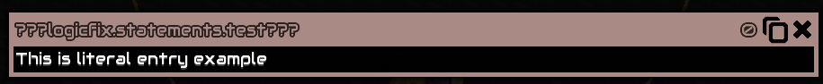
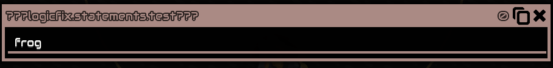
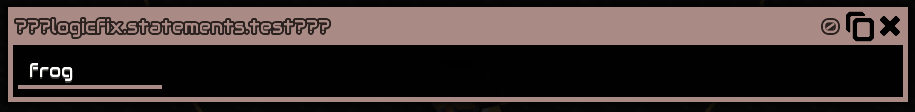
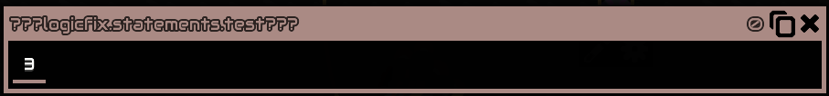
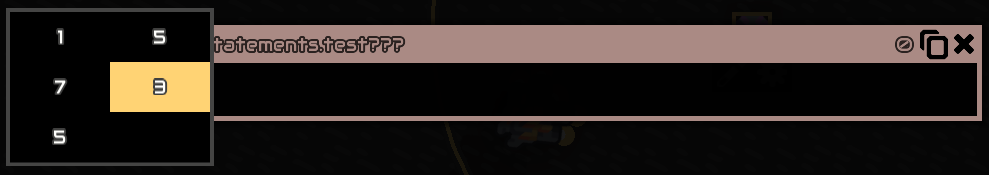
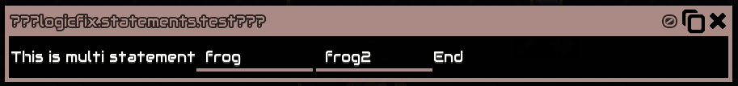
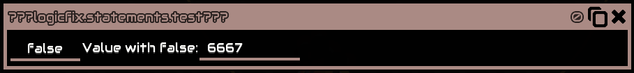
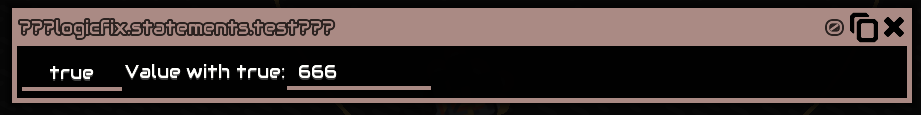
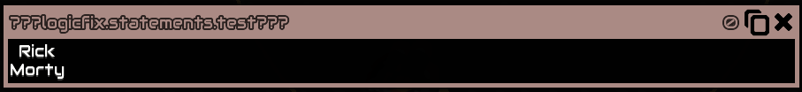

# `logicfix.LStatementEntry` methods

## Literal

`LStatementEntry.literal("This is literal entry example")`



## Translatable

`LStatementEntry.translatable("example_bundle")`


## Large field

`LStatementEntry.largeField("frog", OUTPUT_KEY)`



## Field

`LStatementEntry.field("frog", OUTPUT_KEY)`



## Select

`LStatementEntry.select(new Integer[] {1, 5, 7, 3, 5}, 3, OUTPUT_KEY)`




## `logicfix.instance.MultiLStatementEntry`

```java
LStatementEntry.multi(
    LStatementEntry.literal("This is multi statement"),
    LStatementEntry.field("frog", "t1"),
    LStatementEntry.field("frog2", "t6"),
    LStatementEntry.literal("End")
)
```



* note: do not use LStatementEntry.multi inside LStatementEntry.multi

## `logicfix.instance.MultiLStatementEntry` (Select version)

```java
LStatementEntry.multi(new Boolean[]{true, false}, false, "val", (t) -> {
    if(t) {
        return Seq.with(
                LStatementEntry.literal("Value with true:"),
                LStatementEntry.field("666", "xd5")
        );
    } else {
        return Seq.with(
                LStatementEntry.literal("Value with false:"),
                LStatementEntry.field("6667", "xd7")
        );
    }
})
```




## Row

```java
new LStatementData()
        .add(LStatementEntry.literal("Rick"))
        .add(LStatementEntry.row())
        .add(LStatementEntry.literal("Morty"))
```

